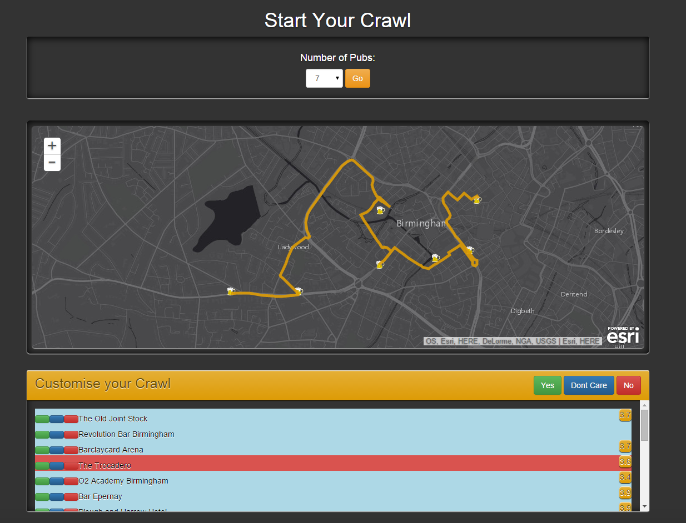

# brumHack
A bar crawl generator app, created at BrumHack in spring 2015
Working in a team of 4, we had 24 hours to come up with an idea then make it!

Written mainly in JavaScript, and a little bit of PHP, we made use of the [esri geolocation api](https://developers.arcgis.com/en/) for the pathing, and the [google maps api](https://developers.google.com/maps/?hl=en) for finding the nearest bars.

